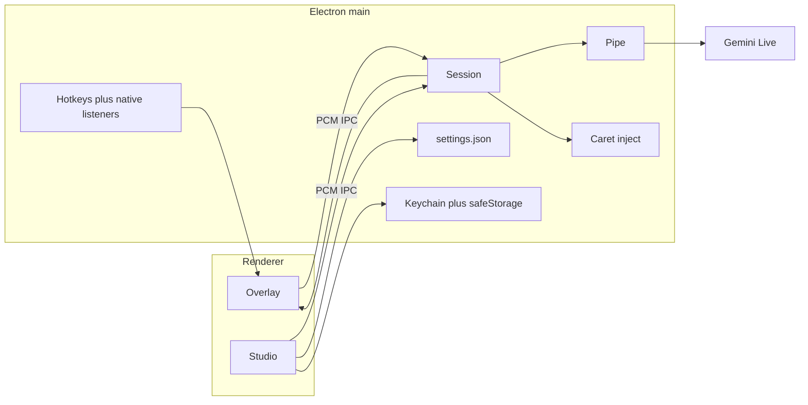

# mSpiky product plan (agent copy)

Other agents: start here. This is the product plan for **mSpiky**, kept in-repo so it survives Cursor plan files.

- Canonical Cursor plan (same content): `.cursor/plans` / `desktop_dictation_app_72b96bd3`
- Code remote: https://github.com/moein8668-git/mSpiky.git
- Research clone (gitignored, MIT, do not vendor): `.scratch/openwhispr` from https://github.com/OpenWhispr/openwhispr
- Spec (ready-for-agent): `.scratch/mspiky/spec.md`

---

# mSpiky

Open-source desktop dictation. Press a hotkey, speak, text appears at the caret. Free software; each user brings a Google AI Studio key. Google usage is not free.

**Code remote:** [https://github.com/moein8668-git/mSpiky.git](https://github.com/moein8668-git/mSpiky.git)

**Locked**

- Name: **mSpiky**
- Primary job: **Overlay-first** Dictation into whatever app has the caret. Studio is settings, file transcription, and history.
- Platforms: Windows, macOS, Linux in v1 (Wayland Caret inject is clipboard-fallback)
- Auth: BYOK (Key in OS keychain, with Electron `safeStorage` fallback)
- Network: app-level SOCKS5 Pipe with remote DNS; never silent-direct if Pipe is on
- Tickets: local markdown under `.scratch/mspiky/` (GitHub is for code and releases, not the agent tracker)
- Shell: **Electron**, not Tauri (reopened after reading OpenWhispr)

The current Vite app in this workspace is a **prototype** for Gemini Live Drafts/Commits. It cannot hotkey, Caret inject, or Pipe.

Research clone (gitignored, do not vendor): `.scratch/openwhispr` from [OpenWhispr/openwhispr](https://github.com/OpenWhispr/openwhispr) (MIT).

## Ask-Matt flow

1. `/setup-matt-pocock-skills` then `/grill-with-docs` (`CONTEXT.md`, ADRs).
2. Destination is visible: Overlay Dictation at the caret. Skip `/wayfinder` unless focus-steal or Live Session protocol fogs over.
3. `/to-spec` → `.scratch/mspiky/spec.md`
4. `/to-tickets` → `.scratch/mspiky/issues/`
5. `/implement` per ticket, TDD, `/code-review`, `/clear` between tickets.

Do not create the Electron shell until tickets are approved.

Keep grilling, spec, and tickets in one context window. Each implement starts fresh.

## Language

Write into root `CONTEXT.md` on first execute.

**mSpiky**: the desktop dictation product. _Avoid_: Live Transcribe, OpenWhispr clone, Booth

**Overlay**: non-activating always-on-top window during Dictation. _Avoid_: popup, pill (OpenWhispr's word; we say Overlay)

**Studio**: main window for settings, files, history. _Avoid_: Control Panel (OpenWhispr), full app

**Dictation**: Overlay speech that becomes Commits at the caret. _Avoid_: captioning

**Draft**: interim hypothesis, Overlay-only, never injected.

**Commit**: finalized segment, eligible for Caret inject.

**Caret inject**: insert a Commit at the focused app's insertion point. _Avoid_: paste (one strategy)

**Pause**: mic muted, Overlay visible, Session kept, `audioStreamEnd` already sent.

**Session**: one Gemini Live WebSocket (~10 min).

**Key**: Gemini API key in keychain / safeStorage.

**Pipe**: SOCKS5 path all Gemini bytes take when enabled, including DNS.

## Learned from OpenWhispr (what we take, what we refuse)

OpenWhispr is the open WisprFlow/Granola-class app: Electron 41, React 19, Tailwind 4, local Whisper/Parakeet, meetings, notes, agents. **mSpiky is not that product.** We steal battle-tested *mechanics*, not scope.

**Take (patterns, rewrite in our tree, MIT attribution in README):**

- Overlay window: `frame: false`, `transparent`, `skipTaskbar: true`, **`focusable: false`**, `alwaysOnTop`, `showInactive`, `backgroundThrottling: false`. If Overlay ever becomes focusable (a Pause click that needs a button), **blur, then setFocusable(false)** so the user's app is foreground again (see their `windowManager.setAssistantPanelOpen`).
- Linux Overlay `type`: `panel` on macOS; on Linux, compositor-specific (`notification` on Sway+XWayland, `toolbar` vs `normal` on GNOME/KDE). Copy the policy, do not invent one compositor flag.
- Caret inject is a **serial clipboard queue**: save clipboard (and Linux primary selection), write text, send a platform paste chord, restore. Never overlapping pastes.
- Platform paste ladder: macOS CGEvent/AppleScript after Accessibility; Windows SendInput helper then nircmd then PowerShell; Linux Shift+Insert for terminals, Electron apps, Konsole, and unclassified Wayland; Ctrl+V otherwise. Konsole+X11 drops fake Ctrl+Shift+V.
- Capture **target window/PID** before inject; refuse inject if the caret target changed.
- Do not dump raw newlines into shells.
- Hotkeys: Electron `globalShortcut` is not enough. Native listeners for push-to-talk (key down/up), modifier-only chords, right-side modifiers, GNOME gsettings, Hyprland/KDE quirks. PTT is unavailable on some Linux setups; surface that in Settings.
- Secrets: OS keychain plus **Electron safeStorage backup** when the keychain is missing (common on Linux).
- Hotkey validator: reserved OS chords, too many keys, modifier-only rules, platform labels.
- Onboarding window separate from Overlay. First-run is Studio-sized, not the Overlay.

**Refuse:**

- Meetings, notes, team cloud, MCP, local Whisper/Parakeet, llama.cpp, Qdrant, calendar, agents, `webSecurity: false` on Studio (OpenWhispr fetches Gemini from the renderer; mSpiky keeps Session + Pipe in the **main process**).
- Their whole native compile zoo (whisper, sherpa, yt-dlp, diarization). We only need paste/hotkey helpers.
- Vendoring `.scratch/openwhispr` into the app.

**mSpiky differentiators vs OpenWhispr:**

- Gemini 3.5 **Live** Drafts and Commits while you speak (they mostly transcribe after a take with Whisper).
- First-class **Pipe** for banned networks.
- Slim Overlay-first app, no cloud account.

## Hard-to-reverse bets (ADRs on first execute)

1. **Electron, not Tauri** - Overlay focus, Caret inject, and hotkeys are a decade of OS bugs. OpenWhispr already paid that cost in Electron. Tauri would re-fight Konsole, Wayland, VS Code empty-selection, PTT. Smaller binaries are not worth it for v1. (This **replaces** the earlier Tauri ADR.)
2. **Gemini Live Session in main process** - `@google/genai` (or raw WebSocket) behind the Session port, through Pipe. Prototype `server/index.ts` is the protocol reference (`Draft`/`Commit`, `audioStreamEnd`, TEXT then AUDIO fallback). Renderer never holds the Key.
3. **Commits inject, Drafts do not.**
4. **Paste-first Caret inject** using OpenWhispr's ladder, then clipboard-only fallback. Flush happens at Pause or Stop (ADR 0007), not while Drafts are still moving.
5. **Pipe never silent-direct.**
6. **Overlay must not activate.** Pause via hotkey is the reliable path; click-Pause is v1-should and must restore focus.

## Product surfaces

### Overlay

Tray-resident. Customizable global hotkey starts Dictation. Non-activating.

Shows: Draft, last Commit, level meter, Pause/Resume, Stop, short error.

**Pause:** stop PCM, `audioStreamEnd`, inject remaining Commits, keep Overlay and Session. Reconnect silently near the 10 min Live limit.

**Hotkeys:** toggle (default, OpenWhispr calls this `tap`) and push-to-talk (`push`). Optional Pause hotkey. Record-a-chord UI with a real validator. Default `Control+Shift+Space`. Native listener when PTT or modifier-only.

On stop: flush, inject leftovers, hide Overlay, restore clipboard.

### Studio

Settings (Key, hotkeys, Pipe, inject method, mic, launch at login), file transcription with live captions, copy/save, optional history. Tray: Show Studio / Start Dictation / Quit.

First-run: Key, mic, macOS Accessibility (required for Caret inject), optional Pipe test. Files after the first successful Caret inject.

## Architecture

- UI: keep React + Vite + Tailwind. Split `src/App.tsx`.
- Mic for Overlay: `getUserMedia` in the **non-focusable** Overlay renderer (the foreground app keeps the caret). PCM to main via IPC.
- Files: decode in Studio webview, PCM to the same Session.
- End users: installer only. Devs: Node (Electron).

**Test seams**

1. **Session port** - PCM in, Draft/Commit/error/closed out. Fake Google in unit tests (`node:test`).
2. **Caret inject port** - Commit in, strategy chain, success or clipboard-fallback. Fake OS send on CI; keep a small fixture matrix (terminal newlines, restore clipboard).
3. **Pipe port** - SOCKS5 or fail closed.

## Pipe

SOCKS5 host/port/user/password (password with Key secrets), remote DNS on, Test button. `socks-proxy-agent` (or undici SOCKS) wrapping the Live WebSocket in main. HTTP CONNECT is v1.1 if cheap.

## Settings and privacy

Keychain + safeStorage: Key, Pipe password.

settings.json: hotkeys, activationMode tap/push, language, smart/verbatim, inject method, Pipe non-secrets, mic id, launch at login, Overlay position, chimes, theme.

Migrate prototype `localStorage` Key once.

Privacy: audio to Google; no mSpiky backend; no recordings by default. MIT. Google API terms. README acknowledges OpenWhispr for Overlay/inject/hotkey prior art.

## Feature map

**v1 must**

- Tray, optional launch at login
- Overlay Dictation, Pause, Stop
- Hotkeys tap + push (with native listener where needed)
- Caret inject (OpenWhispr ladder)
- Settings: Key, Pipe, language, smart/verbatim, mic
- Studio file transcription after Overlay works
- Session reconnect
- First-run: Key, mic, Accessibility, Pipe test
- Installers via electron-builder: Windows nsis, macOS dmg, Linux AppImage + deb
- GitHub Actions on `moein8668-git/mSpiky`

**v1 should**

- History + export
- Custom vocabulary
- Commands: new line, paragraph, period, scratch that
- Click-Pause without stealing focus
- Chimes off by default

**Not v1**

- Meetings, notes, agents, local Whisper
- Auto-update, code signing (document SmartScreen / Gatekeeper)
- Browser extension
- Wayland-native inject beyond clipboard fallback

## Proposed tracer bullets (quiz in `/to-tickets`)

1. **Agent paper trail** - CONTEXT.md, ADRs, `docs/agents/issue-tracker.md`. Blocked by: none.
2. **mSpiky Electron shell** - tray, Studio, Overlay `focusable: false` (prove caret stays in Notepad while Overlay is visible). No Gemini. Blocked by: 1.
3. **Studio Session** - Studio mic produces Drafts/Commits through main-process Session, direct network. Blocked by: 2.
4. **Key secrets** - Settings stores Key; Dictation refuses without it. Blocked by: 2.
5. **Pipe** - Session through SOCKS5; fail closed; Test. Blocked by: 3, 4.
6. **Overlay Dictation** - hotkey, Pause, Draft/Commit on Overlay, PCM from Overlay renderer. Blocked by: 3, 4.
7. **Caret inject** - Flush at Pause/Stop; clipboard restore; Wayland fallback. Blocked by: 6.
8. **Studio files** - playback captions via Session. Blocked by: 3.
9. **First-run and installers** - wizard, CI on mSpiky, user README. Blocked by: 7, 5.

Ticket 7 is the product demo.

## Install

GitHub Releases on `moein8668-git/mSpiky`. No Key shipped.

When execute starts: set `git remote origin` to that URL if this workspace is the working tree; do not commit `.scratch/openwhispr`.

## OS truth

- Wayland: Overlay may work; Caret inject may be clipboard-only.
- Windows elevated/games: inject fails; no admin required.
- Password fields: best-effort skip.
- Linux PTT: may be unavailable; say so in Settings.
- Session ~10 min.

## Risks

- Live WebSocket in Electron main still has no official streaming SDK quality; conformance test with a live Key, not default CI.
- Focus-steal QA: Notepad, Chrome, VS Code, Telegram, Word, Konsole.
- Unsigned binaries. Signing later.
- Google regional blocks: Pipe is what we control.

## Next execute session

1. Setup-matt + CONTEXT.md + ADRs (Electron).
2. `/to-spec` into `.scratch/mspiky/spec.md`.
3. `/to-tickets`, then publish issues.
4. `/implement` tickets 1 then 2 only if the window still has room after tickets are approved. Prefer stopping after tickets if the window is large.
